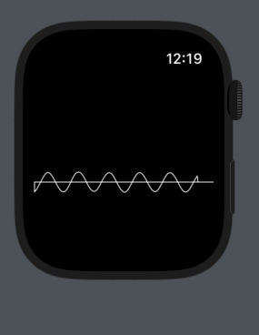
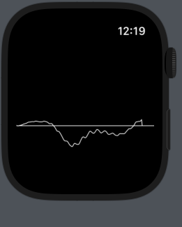

# 5주차 발표 - Audio Engine in Apple Watch

<hr>

### Apple Watch에서의 Audio Engine의 가동과정, 한계, 문제점

`CustomCanvasView.swift`
```swift
import SwiftUI
import UIKit
import CoreGraphics
import WatchKit
import AVFAudio

class CountRepo : ObservableObject {
    @Published var count : Int = 0
}

class ArrayRepo : ObservableObject {
    @Published var cgArray = [CGFloat](repeating: 0, count: 1024)
}

class PathRepo : ObservableObject {
    @Published var newPath : Path!
}

struct CustomCanvasView: View {
    var audioTest : AudioTest

    /** 실시간 렌더링을 위한 Observer 변수.*/
    @ObservedObject var testArray = ArrayRepo() 
    static var cgFloat = [CGFloat](repeating: CGFloat(0), count: 1024)
    var cgContext : CGContext
    var image : UIImage!
    var deviceWidth : CGFloat!
    var deviceHeight : CGFloat!
    @ObservedObject var path = PathRepo()
    @State var testNum : Int = 2
    //@ObservedObject var testNum = CountRepo()
    var device : WKInterfaceDevice
    
    // 여기서부턴 오디오 변수
    var avAudioEngine : AVAudioEngine // 오디오 엔진 선언
    var avAudioNodeBus : AVAudioNodeBus // 오디오 노드 선언(채널 1번째 선언할 예정) - 스테레오
    var inputFormat: AVAudioFormat! // AudioTest 클래스 초기화 시 AVAudioEngine의 .inputNode.inputFormat(forBus : avAudioNodeBus)로 선언하게 된다.
    var avAudioPCMBuffer : AVAudioPCMBuffer // 오디오 PCM 버퍼를 선언하게 된다. (pcmFormat : inputFormat, frameCapacity : 배열 크기)
    var avAudioTime : AVAudioTime
    //var int16data : UnsafePointer<UnsafeMutablePointer<Int16>>?
    //var avAudioNodeTapBlock : AVAudioNodeTapBlock
    
    //var avAudioInputNode = AVAudioInputNode.initialize()
    //var customCanvas
    //var testNum : String
    var session = AVAudioSession()
    
    
    init() {
        self.audioTest = AudioTest()
        /** 현재 애플워치 디바이스의 가로, 높이 속성을 가져오기 위함 */
        self.device = WKInterfaceDevice.current()
        self.deviceWidth = device.screenBounds.width
        self.deviceHeight = device.screenBounds.height
        
        
        // 여기서부턴 오디오 변수
        self.session = AVAudioSession.sharedInstance()
        print("Input Latancy : ")
        print(session.inputLatency)
        self.avAudioEngine = AVAudioEngine()
        print(avAudioEngine.inputNode.latency)
        self.avAudioNodeBus = AVAudioNodeBus(0)
        self.inputFormat = avAudioEngine.inputNode.inputFormat(forBus: avAudioNodeBus) /* inputFormat에 어느 노드버스가 들어가는지 넣는다.*/
        self.avAudioPCMBuffer = AVAudioPCMBuffer(pcmFormat: inputFormat, frameCapacity: 250)! /* pcm 형성 시, inputFormat형태, 그리고 1024개의 배열로 배출된다.*/
        self.avAudioTime = AVAudioTime(sampleTime: 5000, atRate: 44100)
        engineStart()
    }
    
    mutating func engineStart(){
        //avAudioEngine.prepare()
        //inputFormat = avAudioEngine.inputNode.inputFormat(forBus: avAudioNodeBus)
        //var customCanvas = CustomCanvas
        //var testNum = testNum
        print("engineStart()")
        
        
        /** AudioEngine 라이브러리는 AudioNode라는 구조체를 통해 정보를 받는다. */
        var avAudioNodeTapBlock : AVAudioNodeTapBlock = { [self]
            (buffer : AVAudioPCMBuffer, when : AVAudioTime) in

            /** 비동기 작업 실행 코드들*/
            
            var floatData : UnsafePointer<UnsafeMutablePointer<Float>>! = (buffer.floatChannelData)
            var floatDatas = [CGFloat](repeating: 0.000000, count: 250)
             
            /** 디바이스의 크기보다 약간 낮은 180까지로 진행 */
            for num in 0..<180 {
                /** 데이터가 0.999... ~ -0.999... 까지이므로 디스플레이에 표현하기 위해 숫자를 키운다. */
                floatDatas[num] = CGFloat(floatData[0][num] * 1000)
                
            }
            
            /** 주소를 바로 넘기는 것이 최적화에 좋다 판단. */
            self.testArray.cgArray = floatDatas
            
            /** CGPath같은 이미지는 View에 삽입이 불가능하므로, View에 넣을 수 있는 Path로 "일단" 대체 */
            self.path.newPath = Path{ path in
                path.move(
                    to: CGPoint(
                        x : 0,
                        y : 0
                    )
                )
                
                for num in 0..<Int(self.deviceWidth) {
                    path.addLine(to: CGPoint(x: CGFloat(num), y: self.testArray.cgArray[num]))
                }
                /** closeSubPath()를 실행해야 여기서 마무리 한다는 것을 알린다. */
                path.closeSubpath()
            /** 디스플레이 크기가 작으므로 선 굵기는 1, 
            왼쪽 상단이 (0, 0) 위치이므로, offSet 변경 */
            }.strokedPath(StrokeStyle(lineWidth: 1)).offsetBy(dx: 0, dy: self.deviceHeight/2)
            
            /** 실시간 변동을 확인하기 위해 넣었던 테스트 넘버 */
            self.testNum = self.testNum + 1
            
            print(self.testNum)
            
            
            //print(when.sampleTime) // 9.999999747378752e-05
            //print(when.sampleRate) // 48000.0
            //print(when.sampleTime) // 32534953
            //print(when.audioTimeStamp)
            /**
             AudioTimeStamp(
                mSampleTime: 32539753.0, 
                mHostTime: 436679309415,
                mRateScalar: 1.0,
                mWordClockTime: 105553156162144, mSMPTETime: __C.SMPTETime(mSubframes: -12224, mSubframeDivisor: 11392, mCounter: 1, mType: __C.SMPTETimeType, mFlags: __C.SMPTETimeFlags(rawValue: 1), 
                mHours: -23152, 
                mMinutes: 28617, 
                mSeconds: 1, mFrames: 0), 
                mFlags: __C.AudioTimeStampFlags(rawValue: 7), 
                mReserved: 1)
             */
        }
        do {
        /** AudioEngine은 기본적으로 AudioNode를 기반으로 실행하기 때문에, 
         노드에 커스텀한 변수들을 넣는다. */
            avAudioEngine.inputNode.installTap(onBus: avAudioNodeBus, bufferSize: 250, format: inputFormat, block: avAudioNodeTapBlock)
            
            
             
            //CustomCanvas = customCanvas
            avAudioEngine.prepare() // AudioEngine 시작 전 prepare()은 필수입니다.
            try avAudioEngine.start() // 시작!
            print("complete")
        } catch {
            fatalError("starting AVAudioEngine is fail")
        }
        
        
    }
    

    /** 나중에 Path 라이브러리 대신 BitMapImage 생성을 위해 남겨놓은 코드
    mutating func draw() -> Path  {
        self.path.newPath = Path{ path in
            
            path.move(
                to: CGPoint(
                    x : 0,
                    y : 0
                )
            )
            
            path.addLine(
                to: CGPoint(x: 180 , y: 180)
            )
            path.addLine(
                to: CGPoint(x: 50, y: 70)
            )
            
            path.closeSubpath()
        }.strokedPath(StrokeStyle(lineWidth: 1))
        /*
        var newNum = Int(testNum)! + 1
        self.testNum = String(newNum)
         */
        return self.path.newPath
    }
    */
    
    var body : some View {
        
        VStack{
            self.path.newPath
        }
        
    }
    
}

struct CustomeCanvasView_Previews: PreviewProvider {
    static var previews: some View {
        CustomCanvasView()
    }
}

```

<hr>





<hr>

## 아직 남은 문제점

### 1. `AudioEngine`의 렌더링 기간이 0.1초 간격으로 설정되어 있어 바꾸어야 한다.

#### `IOS`, `MacOs`같이 높은 컴퓨팅을 지원하는 기계에만 쉽게 `Latancy`를 바꿀 수 있게 만들어 놨다.

#### 그래도 아직 저 밑바닥에 존재하는 암흑의 메서드가 존재해 어떻게든 바꿀 수 있지 않을까 희망을 품는다.

   <br>

### 2. `WatchOs`에 `AudioEngine`의 렌더링을 구현하기에는 무리가 있다.

#### 최적화에 엄청난 힘을 쏟아야 할 것이다.

#### `For`문을 최소화하고, `Class Address`를 넘겨서 복사하는 행위를 최대한 삼가야 한다.

#### 그것도 무리가 있다면, `Bitmap Image`를 만들어 표현하는 방식이 합리적일 것이라는 생각이 든다.

#### 사실 `Bitmap Image`를 `View`에 넣는 것도 찾질 못했지만, `SceneKit`을 이용한 변환이 가능하지 않을까 생각한다.
