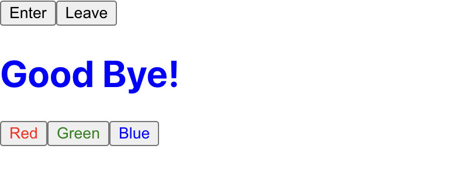

   <br/>

## 함수 컴포넌트에서 `useState` 사용하기
<hr/>

* 사실상 제일 많이 사용하게 됩니다.

* `Hook` 이라는 요소에 속합니다.

   <br/>

### useState 사용하기

`Say.tsx`
```typescript
(...)
import {useState} from 'react'

const Say = () : JSX.Element => {
    const [message, setMessage] = useState('');
    const onClickEnter = () : void => setMessage('Hello');
    const onClickLeave = () : void => setMessage('Good Bye!');

    return (
        <div>
            <button onClick={onClickEnter}>입장</button>
            <button onClick={onClickLeave}>퇴장</button>
        </div>
    )
}
export default Say;
```
* `onClickEnter`, `onClickLeave`는 `setMessage`를 사용하여 간편하게 작성되었습니다.
* `message` : `useState`로 선언한 값을 읽을 수 있습니다.
* `setMessage` : `useState`로 선언한 값을 변경 할 수 있습니다.

* 위의 두 값은 ***비구조화 할당*** 을 사용하여 선언 한 것 입니다.

   <br/>

`App.tsx`
```typescript
(...)
import Say from './Say';

const App = () : JSX.Element => {
    return <Say />;
}
export default App;
```

### 한 컴포넌트에서 useState 여러 번 사용하기

`Say.tsx`
```typescript
(...)
import { useState } from 'react'

const Say = () : JSX.Element => {
    const [message, setMessage] = useState('');
    const onClickEnter = () : void => setMessage('Hello');
    const onClickLeave = () : void => setMessage('Good bye!');

    const [color, setColor] = useState('black');
    // 초기 색깔 지정

    return(
        <div>
            <button onClick={onClickEnter}>입장</button>
            <button onClick={onClickLeave}>퇴장</button>
            <h1 style={{ color }}>{ message }</h1>
            <button style={{ color : 'red' }} onClick={() => setColor('red')}>빨간색</button>
            <button style={{ color : 'green' }} onClick={() => setColor('green')}>초록색</button>
            <button style={{ color : 'blue' }} onClick={() => setColor('blue')}>파란색</button>
        </div>
    );
};
export default Say;
```
* `useState` 를 여러 번 선언하여 사용할 수 있습니다.

* `onClickEnter`, `onClickLeave`는 `setMessage`라는 수정 메서드를 이용합니다.

* `useState`에 인터페이스를 지정하는 방식은 `useState<interface>(인터페이스가 적용 된 어떠한 것)`입니다.

* `JSX` 문법에 `style`을 적용하기 위해서는 객체를 넣어줘야 합니다.

* 따라서, `style={{적용할 내용}}` 의 형식을 띄게 됩니다.

   <br/>

***중괄호가 두개나 적용 된 이유는?***
- 
* 위의 코드에서 `color`을 선언하면, `string`형식의 값을 얻게 됩니다.

* 만약, `style={color}` 로 적용한다면, 객체가 아닌 문자열로 적용됩니다.<br/>
`style={color}` == `style={'black'}`

* `CSS`에서 적용할 때도 `'key' : 'value'`의 형식으로 작성됩니다!<br/>
따라서 `{{}}`와 같이 중괄호 두 개로 묶이게 됩니다.

* `style={{color}}` == `style={color : 'black'}`

* `color` 변수는 `"black"` 이라는 정보를 품은 `key`와 같으므로, 이와 같이 적용됩니다!!

   <br/>

## 결과물
<hr>



<hr/>

## state 사용 시 주의 사항

1. `state`의 값을 조정하고 싶을 때, `useState` 선언 할 때 같이 선언 한 `setXXXX` 메서드를 사용하여 변경해야 합니다. <br/> => 즉, 주어진 `setter` 함수를 사용해야 합니다.

2. `Array`, `Object`의 값을 변경해야 한다면, 아래와 같은 과정을 거쳐야 합니다.
* `Array` 혹은 `Object`의 사본을 만든다.
* 그 사본에 값을 업데이트 한다.
* 그 사본의 상태를 `setState` 혹은 주어진 `setter` 함수로 업데이트 한다!

3. 위와 같은 과정을 거치는 이유는 얕은 복사가 아닌 깊은 복사를 하기 위함입니다.

   <br/>

# 요약

### props

* 부모 컴포넌트에서 값을 지정한다.
* 다만, 자식 컴포넌트에서 `props`의 기본 값을 설정 할 수 있다.
* 수 많은 자식 컴포넌트를 이용 및 조직 시, `props`가 편할 수 있다.

### state

* 자식 컴포넌트에서 값을 지정한다.
* class 형식의 컴포넌트 생성 시, 생성자 사용시 - `props`가 어떠한 형태로든 존재해야 하며, <br/>
생성자(`constructor`)에서 `super(props)` 해 줘야 한다.
* 함수 컴포넌트 사용 시,<br/> `const[ 사용 할 변수, 사용 할 변수의 setter 함수 ] = useState(변수 초기 값)` <br/>
으로 사용 가능하다.
* 리액트 공식 사이트에서 함수 컴포넌트를 밀고 있으니, 함수 컴포넌트로 공부하는 것이 좋습니다!