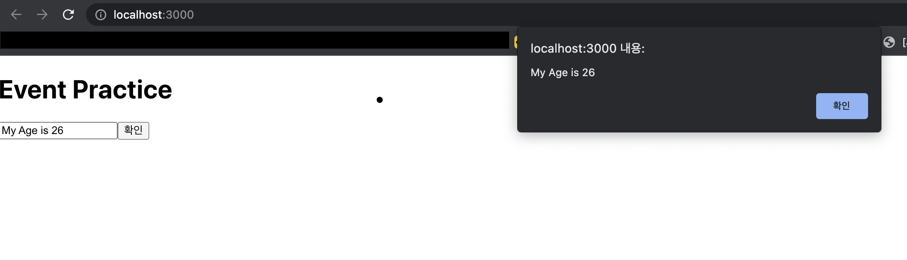

   <br/>

## state와 input을 연관지어 공부하기 - Typescript

***1. state에 input 값 담기***

`EventPractice.tsx`
```typescript
(...)
import { Component } from 'react';

interface StateIFace{
    message : string;
}
/* 이런 방식도 가능합니다!
type StateType = {
    message : string;
}
*/

class EventPractice extends Component {
    // 앞으로 인터페이스를 자주 사용하게 되므로, 지금부터 제대로 적용 시작합니다!
    state : StateIFace = {
        message : ''
    }

    render() : JSX.Element {
        return (
            <div>
                <h1>Event Practice!</h1>
                <input
                    type="text"
                    name="message"
                    placeholder="typing everything!"
                    value={this.state.message}
                    onChange={
                        (e) => {
                            this.setState({
                                message : e.target.value
                            })
                        }
                    }
                />
            </div>
        )
    }
}
export default EventPractice;
```
* `Typescript` 로 `React`를 적용하기 위해서는, `type`or`interface`에 익숙해 져야 합니다!

* 6장부터도 엄청나게 쓰이기 때문에 지금부터라도 익히면 편해지리라고 생각합니다!

* `message` : `key` 이며, `''` : `value(string)` 이기 때문에,<br/>
인터페이스에 `message : string`으로 쓰여집니다.

* `onChange`함수 내부에 `this.setState` 메서드를 넣어서 `state` 값을 변경 할 수 있게 만듭니다.

* `Component`에 `state`를 정의 해 놨으므로, `Component`의 고유 메서드 중<br/>
`setState`를 사용하여 변경 할 수 있게 됩니다!

***그러면 this.setState의 뜻을 세부적으로 봅시다!***

* 그런데, `this.setState()` 내부에 객체 형식으로 값이 넣어져 있는 걸 볼 수 있습니다.<br/>
`this.setState({ message : e.target.value })`

* 뜻을 해석하자면, 이 컴포넌트의 `state` 중에서, `key` 값이 `message`인 `state`를 찾습니다.<br/>
그리고, 그 값을 `e.target.value`로 바꾼다는 뜻입니다!

<hr/>

### ***버튼을 누를 때, comment 값을 공백으로 설정하기***
* `state`의 값을 `alert` 메서드를 통해 직접 보는 예제입니다!

`EventPractice.tsx`
```typescript
(...)
import { Component } from 'react';

// 이번엔 interface와 같은 type으로 적용해보기
type StateType = {
    message : string;
}

class EventPractice extends Component {
    // state에 type 적용
    state : StateType = {
        message : ''
    }
    render() {
        return (
            <div>
                <h1>이벤트 연습</h1>
                <input
                    (...)
                />
                <button onClick={
                    () => {
                        alert(this.state.message);
                        this.setState({
                            message : ''
                        });
                    }
                }>확인</button>
            </div>
        )
    }
}
export default EventPractice;
```
* `<button>`을 클릭 시, `() => { 실행 할 메서드들 }` 이 실행됩니다!

* `alert(this.state.message)`에 의해, 알림 창으로 현재 `state`안의 `message` 값을 <br/>
알수 있게 됩니다

* 직후, `this.setState` 메서드를 통해 `message`의 값을 `''`로 바꾸어 공백으로 만듭니다.
<hr/>

## 결과물



<hr/>

### 임의 메서드 만들기 - Typescript Version

* 이제부터 Type을 지정하기 위해 어느 정도의 Typescript 문법이 들어가게 됩니다!
* 벨트 꽉 매세요~

`EventPractice.tsx`
```typescript
(...)
import { Component } from 'react';

interface StateIFace{
    message : string;
}

class EventPractice extends Component<{}, StateIFace> {
    state : StateIFace = {
        message : '',
    }

    constructor(props : {}){
        super(props);
        // JSX 문법 내부에서 this 로 handleChange를 참조하기 위해
        // .bind(this) 합니다. - 나중에 안씀(참고만 하세요)
        this.handleChange = this.handleChange.bind(this);
        this.handleClick = this.handleClick.bind(this);
    }

    // 그냥 리액트라면 원래 굉장히 쉽습니다
    // normal -> handleChange(e) {...}
    // input에 한 글자라도 입력시 계속 실행되는 메서드입니다
    handleChange(e : React.ChangeEvent<HTMLInputElement>) {
        this.setState({
            message : e.target.value
        });
    }

    handleClick() {
        alert(this.state.message)
    }
}
```