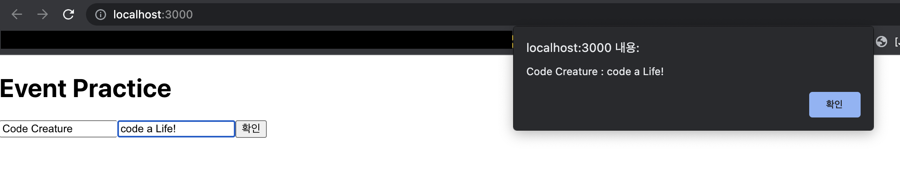

   <br/>

## 함수 컴포넌트로 이벤트 핸들링 하기 - Typescript

***먼저, 바로 전 포스트에서 다룬 코드를 함수 컴포넌트로 변형하겠습니다!***

`EventPractice.tsx` => 함수 컴포넌트로 변형
```typescript
(...)
import { useState } from 'react';

const EventPractice = () : JSX.Element => {
    const [message, setMessage] = useState('');

    const handleChange = (e : React.ChangeEvent<HTMLInputElement>) : void => {
        this.setState({
            message : e.target.value
        })
    }

    const handleClick = () : void => {
        alert(this.state.message);
        this.setState({
            message : ''
        })
    }

    return(
        <div>
            <h1>Eevent Practice!</h1>
            <input
                type="text"
                name="message"
                placeholder="typing everything!"
                value={this.state.message}
                onChange={this.handleChange}
            />
            <button onClick={this.handleClick}>확인</button>
        </div>
    )
}
export default EventPractice;
```
* 함수형 컴포넌트가 훨씬 깔끔하고 편리합니다!

<hr/>

***다음으로 넘어가기 전 알아야 할 것!***

* `input` 내부의 `onKeyPress` 이벤트 타입 (키 누를때 타입)<br/>
=> `e : React.KeyboardEvent`

<hr/>

### 만약 input이 여러 개라면? 

`EventPractice.tsx`
```typescript
(...)
import { useState } from 'react';

const EventPractice = () : JSX.Element => {
    // 1.에서 설명
    const [usename, setUsername] = useState('');
    const [message, setMessage] = useState('');
    
    const onChangeUsername = (e : React.ChangeEvent<HTMLInputElement>) 
    => setUsername(e.target.value);
    
    const onChangeMessage = (e : React.ChangeEvent<HTMLInputElement>)
    => setMessage(e.target.message);

    const onClick = () => {
        alert(username + ': ' + message);
        setUsername('');
        setMessage('');
    }

    //2. 에서 설명
    const onKeyPress = (e : React.KeyboardEvent) => {
        if(e.key === 'Enter') {
            onClick();
        }
    };

    return (
        <div>
            <h1>Event Practice</h1>
            <input
                type="text"
                name="username"
                placeholder="User Name"
                value={username}
                onChange={onChangeUsername}
            />
            <input
                type="text"
                name="message"
                placeholder="Message"
                value={message}
                onChange={onChangeMessage}
                onKeyPress={onKeyPress}
            />
            <button onClick={onClick}>확인</button>
        </div>
    )
}
export default EventPractice;
```

1. * `input`이 두개라면, 그에 따라 `useState`도 두 번 해 주시면 됩니다!
2.  * `React.KeyboardEvent`에서 무슨 키가 눌러졌는지 따로 알 수 있습니다.<br/>
`e.key == 'Enter'`

* 여기서 쓰인 이벤트 타입은 두 개 입니다!<br/>
"인풋에 무언가를 입력" : `React.ChangeEvent<HTMLInputElement>"`<br/>
"HTML의 입력 오브젝트에서 키를 입력" : `React.KeyboardEvent`

<hr/>

## 결과물


<hr/>

* 그런데, `state`의 변수가 많아질 수록 작성 할 코드의 양도 굉장히 많아집니다!

* 따라서, 이를 해결하기 위해 따로 코드를 제작해야 합니다.

* 처음에 `useState`를 선언 할 때, 객체의 형태로 제작하면 됩니다!

`EventPractice.tsx`
```typescript
(...)
import { useState } from 'react';

const EventPractice = () => {
    // 1. 에서 설명
    const [form, setForm] = useState({
        username : '',
        message : '',
    });

    //비구조 할당받기
    // 2. 에서 설명
    const { username, message } = form;
    const onChange = (e : React.ChangeEvnet<HTMLInputElement>) => {
        // 3. 에서 설명
        const nextForm = {
            ...form, // 4. 에서 설명
            [e.target.name] : e.target.value // 원하는 값 덮어 씌우기
        };
        // 복사본을 setter 메서드로 원본에 이식한다.
        setForm(nextForm);
    };

    const onClick = () => {
        alert(username + ': ' + message);
        setForm({
            username : '',
            message'',
        });
    };
    const onKeyPress = (e : React.KeyboardEvent) => {
        if(e.key === 'Enter') {
            onClick();
        }
    }
    
    return(
        <div>
            <h1>Event Practice</h1>
            <input
                type="text"
                name="username"
                placeholder="User Name"
                value={username}
                onChange={onChange}
            />
            <input
                type="text"
                name="message"
                placeholder="Message"
                value={message}
                onChange={onChange}
                onKeyPress={onKeyPress}
            />
            <button onClick={onClick}>확인</button>
        </div>
    );
};
export default EventPractice;
```

1. * `useState`로 만들 수 있는 값은 무궁무진합니다. `string`, `number` 등등 커스텀 객체도 가능합니다.

    * 여기서 만든 커스텀 객체는 `username`과 `message`를 가지고 있습니다.

    * 여러 `key`를 가지고 있는 개체는, `setter` 사용 시 복사본을 사용하여 "깊은 복사"를 해야 합니다.

   <br/>

2. * `const { username, message } = form` 의 뜻은, `form` 내부의 `username` 과 `message` 값을 <br>
중괄호 내부의 변수에 이식하겠다는 의미입니다. - ***중괄호 내부의 이름은 `form` 내부의 이름과 같아야 합니다.***

   <br/>

3. * `setForm`에 들어가는 변수는 객체입니다. 따라서, 단순히 `const nextForm = form`할 수 없습니다.

    * 만약에 복사본을 만들지 않고 방금과 같은 코드를 쓴다면, 객체의 값이 아니라 주소가 복사되어 결과적으로 <br/>
    값이 변경되지 않을 수 있습니다.

   <br/>

4. * `...form` 과 같이 앞에 `.`이 3개 있는 표현을 ***"전개 연산자"*** 라고 합니다.

    * ***"전개 연산자"*** 를 이용해 복사본(`nextForm`)에 복사 한 뒤, `[e.target.name] : e.target.value` 로 원하는 값만 변경합니다.

    * 만약, `<input name="username" ...>` 에 글자 입력 시,  `[username] : e.target.value` 가 됩니다.

<hr/>

## 마지막 요약

### ***함수 컴포넌트를 씁시다..***

근데 클래스형도 분석해야 될 때가 있어 알아야 하는 걸 추천합니다 - 생각보다 많음