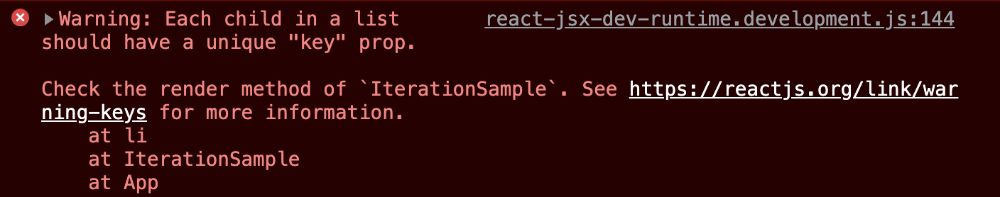

   <br/>

# 6장 - 컴포넌트 반복

## ***자바스크립트 배열의 `map()` 함수

`Example`
```typescript
const arr = [1, 2, 3, 4, 5];

const arrMap = arr.map(num => num * 2);
// arrMap = [2, 4, 6, 8, 10]
```

### ***책의 내용을 참고했습니다***

`arr.map(callback, [thisArg])`

* `callback` : 새로운 배열의 요소를 생성하는 함수로 파라미터는 다음 세 가지 입니다.
    * `currentValue` : 현재 처리하고 있는 요소
    * `index` : 현재 처리하고 있는 요소의 `index` 값
    * `array` : 현재 처리하고 있는 원본 배열

   <br/>

* `thisArg(선택 항목)` : `callback` 함수 내부에서 사용할 `this` 레퍼런스

### ***쉽게 풀이 해 볼까요?***
Ex - `arr.map(num => num * 2)`

* `arr`는 배열입니다. 값은 `[1, 2, 3, 4, 5]`를 가지고 있습니다.

* 1 부터 5까지 모든 값에 대해 `num => num * 2`(callback) 를 적용하여 배열을 반환합니다.

* `1 => 2`, `2 => 4`, `3 => 6`, `4 => 8`, `5 => 10`

* 즉, `const arrMap` 의 값은 `[2, 4, 6, 8, 10]` 가 됩니다.

<hr>
   <br/>

## 데이터 배열을 컴포넌트 배열로 변환하기 - Typescript

`IterationSample.tsx`
```typescript
import React from 'react';

// Typescript에서 타입을 적지 않아도 되는 경우가 존재합니다.
// 이는 코드 내부에서 자동으로 타입 추정이 되는 경우에 해당합니다.

const IterationSample = () => {
    const names = ['눈사람', '얼음', '눈', '바람'];

    // 1. 에서 설명
    const nameList = names.map(name => <li>{name}</li>);
    
    // 2. 에서 설명
    return <ul>{nameList}</ul>;
}
```
1. * `JSX` 문법에서 `Javascript` 문법을 쓰고 싶으면 `{ }` 안에 작성해야 하고,<br/>
`Javascript` 문법에서 `JSX` 문법을 쓰고 싶으면 `( )` 안에 작성해야 합니다.

    * 그런데, `names.map(name => <li>{name}</li>)` 를 보시면 `( )`안에 `<li>`가 작성되지 않았습니다.

    * 이것은 `=>`(화살표 문법) 후에 바로 `JSX` 컴포넌트를 반환하기 때문입니다.

   <br/>

2. * 그렇다면 `return <ul>{nameList}</ul>` 의 값은 어떻게 될까요?

```html
<ul>
    <li>눈사람</li>
    <li>얼음</li>
    <li>눈</li>
    <li>바람</li>
</ul>
```
* 즉, `nameList`의 타입은 `JSX.Element[]`로서 풀이됩니다.

   <br/>

### ***Typescript를 최대한 넣어 보겠습니다 - 어짜피 나중에 써야되서 그렇습니다 ㅋㅋ***

`IterationSample.tsx` - 최대한 Type 넣기
```typescript
import React from 'react';

const IterationSample = () : JSX.Element => {
    // string 배열을 가지고 있다.
    const names : string[] = ['눈사람', '얼음', '눈','바람'];

    // names.map의 callback 함수가 JSX.Element를 반환하므로,
    // nameList는 JSX.Element 배열이 됩니다.
    const nameList : JSX.Element[] = names.map((name : string) : JSX.Element => (<li>{name}</li>))
    //callback 함수의 반환 타입은 JSX.Element입니다.

    return <ul>{nameList}</ul>;
}
export default IterationSample
```
* 타입을 지정해야 한다면, 위에 보이시는 형태의 `Typescript`를 참고하시기 바랍니다!

* 현재 작성중인 코드파일 내부에서 타입이 추정이 되면, 초기에 봤던 코드같이 `Type`을 지정 하지 않아도 되긴 합니다.

### ***그럼 한번 컴포넌트를 렌더링 해보겠습니다.***

`App.tsx`
```typescript
import React, {Component} from 'react';
import IterationSample from './IterationSample';

class App extends Component {
    render() {
        return (
            <IterationSample />
        );
    };
};
export default App;
```
<hr>

## 결과물


* 그런데, 각 `Iteration` 컴포넌트에 고유한 `key` 값이 없어 에러가 나게 됩니다.



* 이를 해결하기 위해, `map()`의 첫번째 변수에 인수를 더 넣어 해결하게 됩니다.

* 첫번째 변수의 1번째 : `currentValue`, 2번째 : `index`

* ***1번째*** : 현재 작업중인 배열 중 하나 , ***2번째*** : 그 배열의 인덱스

`IterationSample.tsx` - key를 추가 한 버전
```typescript
import React from 'react';

const IterationSample = () => {
    const names = ['눈사람', '얼음', '눈', '바람'];
    const nameList = names.map((name : string, index : number) => <li key={index}>{name}</li>)

    return <ul>{nameList}</ul>;
}
export default IterationSample;
```