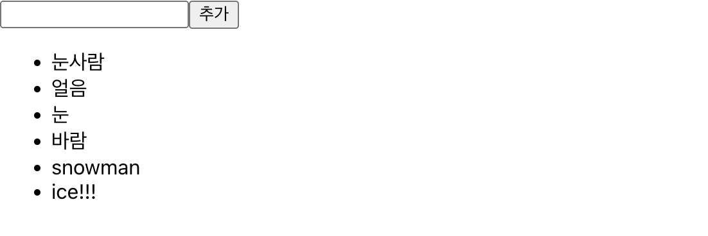

   <br/>

## 초기 상태 설정하기 - Typescript Version

* `<li>` 항목에 `key` 속성에 `index`를 넣게 되면, 나중에 배열이 변경 될 때 효율적이지 못합니다.

* 따라서, `useState`를 활용하여 동적인 배열을 렌더링 하는 법을 `Typescript`로 구현하도록 하겠습니다.

   <br/>

`IterationSample.tsx`
```typescript
import React, {useState} from 'react';

// 1. 에서 설명
interface nameIFace{
    id : number;
    text : string;
}

const IterationSample = () : JSX.Element => {
    // 2. 에서 설명
    const [names, setNames] = useState<nameIFace[]>([
        {id : 1, text : '눈사람'},
        {id : 2, text : '얼음'},
        {id : 3, text : '눈'},
        {id : 4, text : '바'}
    ]);

    const [inputText, setInputText] = useState<string>('');
    const [nextId, setNextId] = useState<number>(5); //새로운 항목을 추가할 때 사용 할 id

    // 3. 에서 설명
    const nameList = names.map(name => <li key={name.id}>{name.text}</li>)
    return <ul>{nameList}</ul>
}
export default IterationSample;
```
1. * `useState`로 선언될 `names`의 타입을 정확히 하기 위해 선언 한 `interface`입니다.

   <br/>

2. * `{id : 1, text : '눈사람'}` 의 ***type*** 은 `nameIFace`입니다.
    * `useState`를 선언하며 초기값의 형태를 [`nameIFace`, `nameIFace`, `nameIFace`, ...] 이므로<br/>
    `useState`의 `interface`를 `nameIFace[]`로 지정 한 것 입니다. - `nameIFace` 배열

   <br/>

3. * `names.map(name => .....)` 선언하게 되면, `name`의 타입은 `nameIFace` 가 됩니다.
    * `nameIFace` 가 가지고 있는 값은 `id` 와 `text`였죠?
    * 따라서 `name => <li key={name.id}>{name.text}</li>` 하면 고유 값을 인덱스로 넣지 않을 수 있습니다.

<hr/>

## 데이터 추가 기능 구현하기 - Typescript Version

* `input` 과 `button`을 추가하여 구현합니다.

* ***추가*** 버튼 클릭 시, `concat` 메서드를 이용하여 복사본에 복사 한 뒤, `setNames()`로 <br/>
새로운 배열을 설정합니다.

    * `setNextId(nextId + 1)`을 통해 다음에 넣을 고유 값도 증가시킵니다.
    * `setInputText('')` 하여 `input` 칸을 비웁니다.

* 이전에 포스팅 하였던 `Typescript` 문법에 대해서 배우셨으리라고 생각하고 <br/>
시원하게 작성 해 보겠습니다. - 참고로 지금까지도 복사 붙여넣기 하지 않았습니다..

`IterationSample.tsx`
```typescript
import React, {useState} from 'react';

interface NameIFace{
    id : number;
    text : string;
}

const IterationSample = () : JSX.Element => {
    const [names, setNames] = useState<NameIFace[]>([
        {id : 1, text : '눈사람'},
        {id : 2, text : '얼음'},
        {id : 3, text : '눈'},
        {id : 4, text : '바람'},
    ]);
    const [inputText, setInputText] = useState<string>('');
    const [nextId, setNextId] = useState<number>(5); 

    // <input>에 글자 하나마다 실행되는 메서드
    const onChange = (e : React.ChangeEvent<HTMLInputElement>) : void => setInputText(e.target.value);

    // <button> 클릭 시 실행되는 메서드
    const onClick = () : void => {
        // 복사본 nextNames에 새로운 항목을 concat으로 연결하여 전달합니다.
        const nextNames = names.concat({
            id : nextId,
            text : inputText,
        });
        //다음 클릭 시 고유 key값을 위해 nextId를 +1 합니다.
        setNextId(nextId + 1);
        // 새로 만든 복사본 배열에 setNames를 사용하여 새로운 names를 설정합니다.
        setNames(nextNames);
        // <input> 안의 내용을 비웁니다.
        setInputText('');
    };

    const namesList = names.map((name : NameIFace) => <li key={name.id}>{name.text}</li>);

    return (
        <div>
            <input value={inputText} onChange={onChange} />
            <button onClick={onClick}>추가</button>
            <ul>{namesList}</ul>
        </div>
    );
};
export default IterationSample;
```
* `const onClick` 함수에 복사본을 만들 당시 `concat`을 쓰는 이유는, 새로운 배열을 만들어 주기 때문입니다.

* `push`는 기존 배열 자체를 변경해버리기 때문에 쓰지 않습니다.

<hr>

## 결과물



* 

<hr>

   <br>

## 데이터 제거 기능 구현하기

* `<li>` 부분을 더블 클릭 했을 때 해당 항목이 사라지는 기능을 구현합니다.

* 불변성을 유지하면서 배열의 특정 항목을 지우기 위해 배열의 내장 함수 `filter`를 사용합니다.

`Filter Example 1`
```typescript
const numbers = [1, 2, 3, 4, 5];
const biggerThanThree = numbers.filter(number => number > 3);
// result : [4, 5]
```
* 메서드의 원형은 `배열.filter(callback)`입니다.

* `callback` 함수를 제작할 때, 주어진 조건에 만족하는 원소들만 반환한다고 생각하시면 편합니다.

***또 다른 예제***

`Filter Example 2`
```typescript
const numbers = [1, 2, 3, 4, 5];
const isNotThree = numbers.filter(number => number !== 3);
// result : [1, 2, 4, 5];
```
* 주어진 조건에 만족하는 원소들만 반환하므로, `3이 아닌` 원소들을 새로운 배열로 반환한다고 생각하시면 됩니다.

   <br/>

`IterationSample.tsx`
```typescript
import React, {useState} from 'react';

interface NameIFace{
    id : number;
    text : string;
}

const IterationSample = () : JSX.Element => {
    const [names, setNames] = useState<NameIFace[]>([
        {id : 1, text : '눈사람'},
        {id : 2, text : '얼음'},
        {id : 3, text : '눈'},
        {id : 4, text : '바람'},
    ]);
    const [inputText, setInputText] = useState<string>('');
    const [nextId, setNextId] = useState<number>(5);

    const onChange = (e : React.ChangeEvent<HTMLInputElement>) : void => setInputText(e.target.value);
    const onClick = () : void => {
        const nextNames = names.concat({
            id : nextId,
            text : inputText
        });
        setNextId(nextId + 1);
        setNames(nextNames);
        setInputText('');
    };

    // onRemove(해당 객체의 key=id 값)이 실행되면, 
    // 해당 id를 가진 객체만 삭제한다.
    const onRemove = (id : number) => {
        const nextNames = names.filter((name : NameIFace) => name.id !== id);
        setNames(nextnames);
    }

    // onDoubleClick에 콜백 함수를 넣어, 더블 클릭 시에만 실행 될 수 있게 한다.
    const namesList = names.map((name : NameIFace) => (
        <li key={name.id} onDoubleClick={() : void => onRemove(name.id)}>
            {name.text}
        </li>
    ));

    return (
        <div>
            <input value={inputText} onChange={onChange} />
            <button onClick={onClick}>추가</button>
            <ul>{namesList}</ul>
        </div>
    )
}
export default IterationSample;
```
<hr>

## 결과물


* 전부 더블클릭하여 리스트를 없앤 모습입니다.

<hr/>