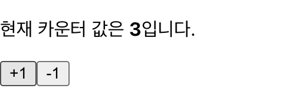

# 8장 - Hooks

### ***이번엔 프로젝트 이름을 바꿔서 생성 해 볼 것입니다.***

기존 이름 : `hello-react`<br/>
새로운 이름 : `hook-tutorial`<br/>

따라서, 타입스크립트 프로젝트를 생성하기 위한 새로운 명령어는,<br/>
`yarn create react-app hooks-tutorial --template typescript` 입니다.

* `--template typescript`를 입력하여 생성하면, 리액트에 `typescript`를 적용하기 위한 기초 라이브러리를<br/>
자동으로 다운받습니다.
* 그리고 실행하기 위한 환경을 거의 완벽히 `typescript`에 맞춰서 프로젝트르 생성하므로, <br/>
맨 처음에 이 명령어로 프로젝트를 실행 하는 것이 옳다고 볼 수도 있습니다.

   <br/>

## `useState`

* 가장 기본적인 `Hook`입니다.

* 함수 컴포넌트가 `JSX` 내부에서 가변적인 값을 쓸 수 있게 해줍니다.

* 함수 컴포넌트에서 상태를 관리해야 한다면 이 Hook을 사용하면 됩니다.

* `src` 디렉토리에 `Counter.tsx` 파일을 생성하여 시작하겠습니다.
<hr/>

`Counter.tsx`
```typescript
import React, {useState} from 'react';

const Counter = () : JSX.Element => {
    // 밑에서 설명
    const [value, setValue] = useState<number>(0);
    // useState(0); 해도 상관없습니다.

    return (
        <div>
            <p>
                현재 카운터 값은 <b>{value} 입니다.</b>
            </p>
            <button onClick={() => setValue(value + 1)}>+1</button>
            <button onClick={() => setValue(value - 1)}>-1</button>
        </div>
    )
}
export default Counter;
```
* `useState()` 내부에는 관리할 상태의 "***초기값***"을 넣어줍니다.

* `useState()` 의 반환값은 "배열"입니다.
    
    * 1번째 원소 : 상태 값 : `state`
    * 2번째 원소 : 상태를 설정하는 함수입니다. : `(setter)`

* `<button>`에 `onClick` 속성에 `callback`함수를 넣어, 클릭 시 `setValue`가 실행되게 합니다.

`App.tsx`
```typescript
import React from 'react';
import Counter from './Counter';

const App = () : JSX.Element => {
    return <Counter />;
};
export default App;
```
* 이를 통해 `Counter.tsx` 컴포넌트의 내용물을 볼 수 있습니다.

<hr>

## 결과물



<hr>

* 만약 관리해야 할 상태가 여러 개라면, `useState`를 여러 번 쓰시면 됩니다.

`Example`
```typescript
const [name, setName] = useState<string>('');
const [nickname, setNickname] = useState<string>('')
// <string>은 안넣어줘도 되지만, 추후 복잡한 객체를 useState로 사용 할 시, 적용이 필요해 집니다.
```

<hr>
   <br>

## useEffect

* `useEffect`는 리액트 컴포넌트가 렌더링 될 때 마다 특정 작업을 수행하도록 설정할 수 있는 `Hook`입니다.

* 위의 항목을 이해하기 위해 아래에 예시를 써 보겠습니다.

   <br/>

`Info.tsx`
```typescript
import React, {useState, useEffect} from 'react';

const Info = () => {
    const [name, setName] = useState('');
    const [nickname, setNickname] = useState('');

    // useEffect 사용
    // 렌더링 될 때 마다 실행된다!
    useEffect(() => {
        console.log('렌더링이 완료되었어요!');
        console.log({
            name,
            nickname
        });
    });

    const onChangeName = (e : React.ChangeEvent<HTMLInputElement>) : void => {
        setName(e.target.value);
    }

    const onChangeNickname = (e : React.ChangeEvent<HTMLInputElement>) : void => {
        setNickname(e.target.value);
    }

    return (
        (...)
    );
}
export default Info;
```


* 이 `Hook`은 특정 `state`가 변경되었을 때, 특정 작업을 수행하도록 설정하는 경우가 많습니다.

* 시스템 자원의 효율을 높이기 위해, `useEffect`의 2 번째 파라미터에 배열을 넣습니다.

* 이 배열로 렌더링 조건을 걸 수 있습니다. - 책을 참고하여 밑의 예시를 적어놓겠습니다.

   <br>

***마운트 될 때만 실행하고 싶을 때***

* 화면에 맨처음 렌더링 될 때만 실행하고, 업데이트 때에는 실행하지 않습니다.

* 이를 위해 2 번째 파라미터에 비어 있는 배열을 넣습니다.

`Example - 1`
```typescript
useEffect(() => {
    console.log('마운트 될 때만 실행됩니다.');
}, []);
```

   <br/>

***특정 값이 업데이트 될 때만 실행하고 싶을 때***

* `useEffect`의 두 번째 파라미터인 배열에, 해당 특정 값을 넣습니다.

`Example - 2`
```typescript
useEffect(() => {
    console.log(name);
}, [name]);
// name 변수는 Info.tsx 컴포넌트의 상단에서 useState로 선언했던 변수입니다.
// name 값이 변할 때만 렌더링하겠다는 의미입니다.
```