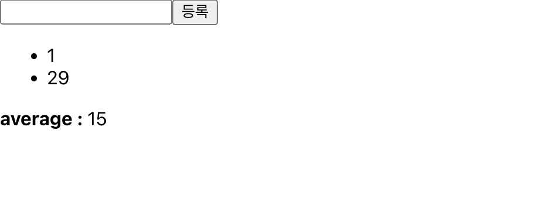
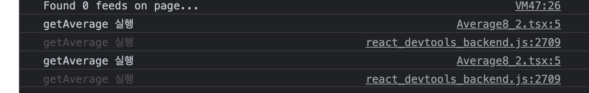

   <br>

## `useReducer` - Typescript Version

* `useState`보다 더 다양한 컴포넌트 상황에 따라 다양한 상태를 업데이트 할 때 사용하는 `Hook`입니다.

* `reducer`는 2 가지 인수를 전달받습니다.

    * 1. 현재 `state`
    * 2. 업데이트를 위해 필요한 정보를 담은 액션(`Action`)값을 전달

   <br>

`Reducer Example`
```typescript
function reducer(state, action) {
    return { ... };
}
```
* 리듀서 함수는 `state` 업데이트 시, 좀 더 디테일하게 조작 할 수 있다는 장점이 있습니다.

* `action` 값은 주로 객체 값으로 이루어져 있습니다.

   <br>

`Action Example`
```typescript
{
    type : 'INCREAMENT',
}
```
* 추후, 리덕스에서 배우게 될 액션은 `type`이 무조건 필요하지만,<br/>
* `useReducer`는 반드시 `type`을 가질 필요가 없습니다.

* 곧 배울 리듀서 함수는 `string` 값에 따라 `state`를 업데이트 한다고 생각하시면 됩니다.

   <br>

`Counter.tsx`
```typescript
import React, {useReducer} from 'react';

// state 내부의 value 값은 number 형식입니다.
interface State{
    value : number;
}

// 요청을 보낼 때, 객체 형태 내부에 'type'을 넣어 전달합니다.
// 'type'은 'string' 타입니다.
interface ActionType{
    type : string;
}

// 1. 에서 설명
function(state : State, action : ActionType) {
    switch(action.type){
        case 'INCREAMENT':
            return { value : state.value + 1 };
        case 'DECREAMENT':
            return { value : state.value - 1 };
        default:
            return state;
    }
}

const Counter = () : JSX.Element => {
    // 2. 에서 설명
    const [state, dispatch] = useReducer(reducer, {value : 0});
}

return (
    <div>
        <p>
            현재 카운터 값은 <b>{state.value}</b>입니다.
        </p>
        <button onClick={() => dispatch({ type : 'INCREAMENT' })}>
        <button onClick={() => dispatch({ type : 'DECREAMENT' })}>
    </div>
)
export default Counter;
```

1. `state` 값을 기존에는 `setXXX` 함수로 변경했지만, 이러한 `setter`함수를 외부로 꺼내 <br>
직접 만든 모습입니다.
    
    * 리듀서 함수는 현재 상태인 `state` 그리고 행동양식을 전달받는 `action` 인수를 받습니다.
    * 자동으로 타입 지정이 되는 메서드는 아니므로, `Type`을 지정 해 주어야 합니다.
    * 전달받은 `action` 객체의 `type`의 값에 따라 스위칭되어 행동이 달라집니다.

   <br>

2. `const [state, dispatch] = useReducer(reducer, {value : 0})`<br>
에 대해 뜯어가며 설명하겠습니다.

    * `state` : 배열의 첫 번째 인자는 `useReducer`의 상태를 접근 할 수 있습니다.
    * `dispatch` : `state`를 변경하기 위해 접근 할 함수입니다.
    * `reducer` : 자신이 직접 만든 리듀서 함수를 등록합니다.
    * `{value : 0}` : `state`의 초기 상태를 설정합니다.

* 즉, 기존에 버튼을 클릭 할 때, 실행되던 함수의 모습이 달라졌습니다.
    
    * `onClick={() => setValue(value + 1)}` : `useState`
    * `onClick={() => dispatch({ type : 'INCREAMENT' })}`

* ***기존방식*** : `onClick` 내부 함수에서 직접 `state` 값 변경
* ***새 방식*** : `onClick`내부 함수에서 `reducer`함수에 <br/>
`state` 값을 `INCREAMENT`하라고 명령

   <br>

## 인풋 상태 관리하기 - Typescript Version

* 기존에 사용하던 `e : React.ChangeEvent<HTMLInputElement>`<br/>
에 대해 다시 생각 할 필요가 있습니다.

* `e`의 뜻은 위에 있듯이 `Input`에 대한 엘리먼트를 의미하지만,<br>
`e`는 `HTML DOM`이 가진 고유의 특성을 가지고 있습니다.

`Example`
```typescript
<input name="nickname" value={nickname} onChange={onChange}>
```
* `e`는 이 `HTML` 엘리먼트에 대한 정보를 가지고 함수로 가게 됩니다!

    * `e.target.name` : `"nickname"`
    * `e.target.value` : `nickname`

* 이를 알고 예제를 보시면 이해하시기 편할 겁니다.

`Info.tsx`
```typescript
import React, { useReducer } from 'react';

interface State{
    name : string;
    nickname : string;
}

interface Action{
    name : string;
    value : string;
}

function reducer(state : State, action : Action) {
    return {
        ...state, // 기존에 있던 내용 복사
        [action.name] : action.value, // 해당 인풋만 변경
    }
}

const Info = () : JSX.Element => {
    const [state, dispatch] = useDispatch(reducer, {
        name : '',
        nickname : ''
    });

    // 비구조화 할당
    const { name, nickname } = state;

    // 위에서 설명했듯이, e.target이 가진 name, value 속성을 전달
    const onChange = (e : React.ChangeEvent<HTMLInputElement>) => {
        dispatch(e.target);
    }

    return (
        <div>
            <div>
                <input name="name" value={name} onChange={onChange} />
                <input name="nickname" value={nickname} onChange={onChange} />
            </div>
            <div>
                <div>
                    <b>이름 : </b> {name}
                </div>
                <div>
                    <b>닉네임 : </b> {nickname}
                </div>
            </div>
        </div>
    )
}
export default Info;
```
* 렌더링을 원할 시, `App.tsx`에서 `import`하고 리턴하면 됩니다.
`App.tsx`
```typescript
import React from 'react';
import Info from './Info';

const App = () : JSX.Element => {
    return <Info />;
}
export default App;
```

   <br>

## `useMemo`

* 컴포넌트에 내장 함수를 넣을 때, 굉장히 치명적인 문제가 있습니다.

* 보통 `JSX` 내부에 `{ }` 안에 내장함수를 넣어 바로 결과를 볼 수 있습니다.

* 그런데, `input` 컴포넌트에 글자 하나를 넣을 때 마다 실행 되며,<br>
내장 함수도 같이 실행 되어 시스템 자원을 갉아먹습니다.

* 따라서, 이를 `useMemo`를 이용하여 최소화할 수 있습니다.

* `useMemo`를 사용하면, 특정 값이 변경되었을 때만 함수 연산을 실행 할 수 있습니다.

`Average.tsx`
```typescript
import React, {useState, useMemo} from 'react';

// number 배열을 인수로 받고, number을 리턴 한다는 의미
const getAverage = (numbers : number[]) : number => {
    console.log('getAverage 실행');

    // numbers가 비어있다면, 그냥 0을 반환
    if(numbers.length === 0) return 0;

    // 배열의 내장 함수 reduce! 내부의 원소를 하나로 합칠 함수를 넣습니다.
    const sum = numbers.reduce((a, b) => a + b);
    return sum / numbers.length;
}

const Average = () : JSX.Element => {
    // <number[]> 를 무조건 선언해 주어야 합니다!
    // 미선언 시, 타입이 never[]이 되어 concat이 어렵습니다.
    const [list, setList] = useState<number[]>([]);
    const [number, setNumber] = useState('');

    const onChange = (e : React.ChangeEvent<HTMLInputElement>) => {
        setNumber(e.target.value);
    }
    const onInsert = () => {
        // 1. 에서 설명
        const nextList = list.concat(parseInt(number));
        setList(nextList);
        setNumber('');
    };

    // 2. 에서 설명
    const avg = useMemo(() => getAverage(list), [list]);

    return (
        <div>
            <input value={number} onChange={onChange} />
            <button onClick={onInsert}>등록</button>
            <ul>
                {list.map((value, index) => (
                    <li key={index}>{value}</li>
                ))}
            </ul>
            <div>
                <b>평균값 : </b> {avg}
            </div>
        </div>
    )
}
export default Average;
```
* `useState`로 만들어진 `list`를 기반으로, `<ul>`을 구성하고 있습니다.

* 평균값은, `useMemo`로 작성된 `avg`를 사용하고 있습니다.

   <br>

1. * `const nextList = list.concat(parseInt(number));`
    * `number`값은 `useState`에서 `string`으로 선언되었습니다.
    * 따라서, `parseInt()`를 사용하여 `number`값으로 바꿉니다.
    * `list`를 `useState`로 생성 할 때, `number[]`로 선언하여<br>
    `concat`으로 복사본으로 복사가 가능합니다.

   <br>
   
2. * `const avg = useMemo(() => getAverage(list), [list]);`
    * `useMemo()` 의 1번째 인수 : `callback`함수
    * `useMemo()` 의 2번째 인수 : 이 값이 변경되면 실행된다는 의미!
    * 요약 : `list` 배열값이 변경되면, `() => getAverage(list)`를 <br>
    실행한다는 의미입니다.
    * `const avg`에 담아져서, `JSX` 문법 내부에 선언된 것을 볼 수 있습니다.<br>
    * 컴포넌트 자체가 리렌더링 될 때 마다, `getAverage` 연산은 실행되지 않고,<br>
    `list`가 변할 때에만 실행 될 것 입니다.

* 이제 `App.tsx`를 변경하여 결과물을 봅시다!

`App.tsx`
```typescript
import React from 'react';
import Average from './Average';

const App = () : JSX.Element => {
    return <Average />;
}
export default App;
```

<hr>

## 결과물




* 희미한 글씨로 똑같은 내용이 나온 것은 추후에 설치하게 될 <br>
`react-devtool`때문이라서 무시하시면 됩니다.
* 이와 같이 등록 버튼 클릭 시에만 연산이 실행되는 것을 볼 수 있습니다.

<hr>

