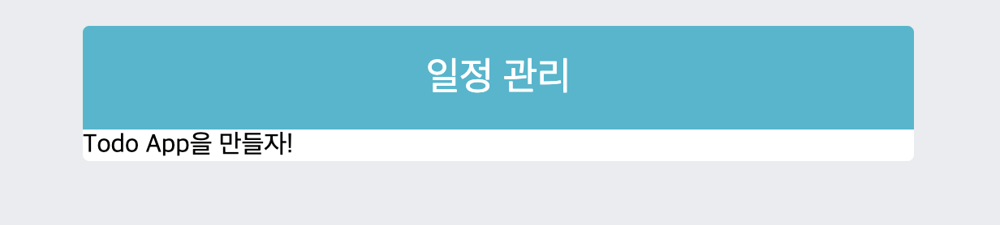
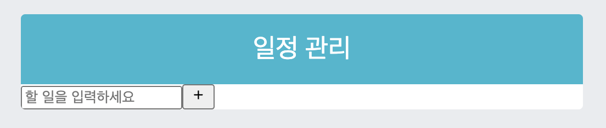
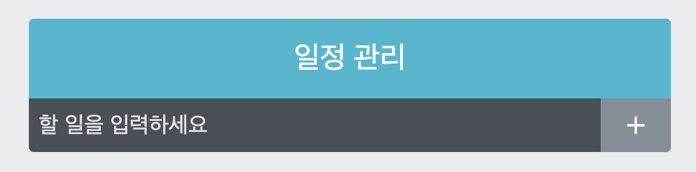
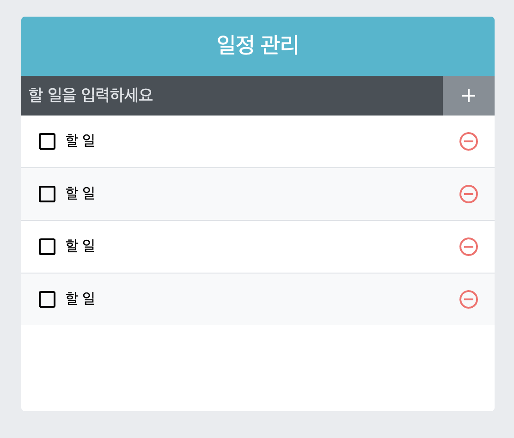

   <br>

# 일정 관리 웹 애플리케이션 만들기

## 프로젝트 준비하기

* `yarn create react-app todo-app --template typescript`
    * 타입스크립트 버전으로 프로젝트를 만듭니다.

* `cd todo-app`
    * `todo-app`디렉토리로 이동합니다.

* `yarn add sass classnames react-icons`
    * 프로젝트에 필요한 라이브러리를 다운받습니다.

* `src` 디렉토리의 `index.css`를 수정합니다.

`index.css`
```css
body{
    margin : 0;
    padding : 0;
    background : #e9ecef;
}
```

* 제대로 적용하기 위해 `App.tsx`내부의 컴포넌트 내용을 삭제합니다.

`App.tsx`
```typescript
import React from 'react';

const App = () : JSX.Element => {
    return <div>Todo App을 만들자!</div>;
}
export default App;
```

* 렌더링 후에 "회색 배경" 그리고 "Todo App을 만들자!" 가 나온다면 성공입니다.

<hr>

## UI 구성하기

* 만들 컴포넌트에 대해 설명합니다.

1. `TodoTemplate` : 화면을 중앙에 정렬, 하위 모든 컴포넌트를 포함한다.

2. `TodoInsert` : `<input>`을 가지고 있으며, 입력된 `state`를 바탕으로 <br>
인풋의 상태를 관리합니다.

3. `TodoList` : `TodoListItem`를 배열로 가지고 있는 컴포넌트입니다.<br>
`todos` 배열을 `props`로 받아 온 후, `map` 함수를 이용하여 여러 개의<br>
`TodoListItem` 컴포넌트로 변환하여 보여 줍니다.

4. `TodoListItem` : `todo`객체를 `props`로 받아 와서, 상태에 따라 다른 UI를 보여 줍니다.(체크 클릭 or 클릭 안함)

* 만들 컴포넌트들은 `src/components` 디렉토리에 넣을 예정이므로,<br>

* `mkdir src/components` 를 콘솔에 입력하여 만들거나 직접 클릭하여 만들면 됩니다.
<hr>

## TodoTemplate 만들기 - Typescript Version

* 먼저 `TodoTemplate.tsx` 그리고 `TodoTemplate.scss` 파일을<br>
`src/components` 디렉토리에 생성하고 시작합니다.

   <br>

`TodoTemplate.tsx`
```typescript
import React from 'react';
import './TodoTemplate.scss';

interface PropIFace{
    children : string;
}

//밑의 코드와 동일합니다.
//const TodoTemplate = ({children} : {children : string}) : JSX.Element => {
const TodoTemplate = ({children} : PropIFace) : JSX.Element => {
    return (
        <div className="TodoTemplate">
            <div className="app-title">일정 관리</div>
            <div className="content">{children}</div>
        </div>
    )
}
export default TodoTemplate;
```
* `App.tsx` 컴포넌트에서 `props`로 내려줄 데이터는 `string`이므로,<br>
비구조화 할당을 위해 `PropIFace`를 선언 해 줍니다.

* 참고로 인터페이스 이름은 마음대로 지으셔도 상관 없습니다!<br>
`ex - Prop or PropFace or propFace ...`

   <br>

`App.tsx`
```typescript
import React from 'react';
import TodoTemplate from './components/TodoTemplate';

const App = () : JSX.Element => {
    // props로 내려 줄 children 영역에 "Todo App을 만들자!"
    // 라는 값이 들어감.
    return <TodoTemplate>Todo App을 만들자!</TodoTemplate>
};
export default App;
```
<hr>

## 결과물



<hr>

## TodoInsert 만들기

* 이것 또한 `src/components`디렉토리에 생성하면 됩니다.

`TodoInsert.tsx`
```typescript
import React from 'react';
import {MdAdd} from 'react-icons/md';
import './TodoInsert.scss';

const TodoInsert = () : JSX.Element => {
    return (
        <form className="TodoInsert">
            <input placeholder="할 일을 입력하세요" />
            <button type="submit">
                <MdAdd />
            </button>
        </form>
    )
}
```

* `<button>`에 `type`이 들어간 것은 추후 `<form>`에서 엔터를 누를 시<br>
이벤트를 발생시키기 위해서입니다.

* 이제 이 컴포넌트를 `TodoTemplate`의 `props` 속성에 `children`으로<br>
넣어보겠습니다.

   <br>

`App.tsx`
```typescript
import React from 'react';
import TodoTemplate from './TodoTemplate';
import TodoInsert from './TodoInsert';

const App = () : JSX.Element => {
    return (
        <TodoTemplate>
            <TodoInsert/>
        </TodoTemplate>
    )
}
```
* 그리고, `children`이 `string` 처리 되어 있으므로 오류가 날 것입니다.

* 따라서, `string => JSX.Element`로 바꾸어 줘야 합니다.

`TodoTemplate.tsx`
```typescript
import React from 'react';
import './TodoTemplate.scss';

interface PropIFace{
    // children : string에서 변경 한 후 입니다.
    children : JSX.Element;
}

const TodoTemplate = ({children} : PropIFace) => {
    (...)
}
export default TodoTemplate;
```

<hr>

## 결과물



* 하지만, 입력 창이 알맞게 차지 않아 디자인이 아직까지는 별로인 모습입니다.

* 따라서, 후의 `.scss`파일로 디자인을 변경합니다.

<hr>

`TodoInsert.scss`
```scss
.TodoInsert{
    display : flex;
    background : #495057;

    // TodoInsert class 내부의 input 태그
    input{
        // 기본 스타일을 초기화시킵니다.
        // 외부의 background : #495057과 동화됩니다.
        background : none;

        // 깔끔하게 바깥 선을 없앱니다.
        outline : none;
        border : none;

        padding : 0.5rem;
        font-size : 1.125rem;
        line-height : 1.5;
        color : white;

        // 이 태그에 해당하는 속성 중의 placeholder 디자인을 변경한다.
        &::placeholder{
            color : #dee2e6;
        }

        // 버튼을 제외한 모든 영역을 차지합니다.
        flex : 1;
    }
    button{
        //기본 스타일을 초기화합니다.
        background : none;

        // 깔끔하게 바깥 선을 없앱니다.
        outline : none;
        border : none;

        //배경 색을 바꿉니다.
        background : #868e96;

        //글자 색을 하얀색입니다.
        color : white;
        padding-left : 1rem;
        padding-right : 1rem;
        font-size : 1.5rem;
        display : flex;
        align-items : center;
        cursor : pointer;

        //cursor가 버튼 위로 올라올 경우
        // 0.1초 안에 부드럽게 바뀝니다.
        transition : 0.1s background ease-in;

        // 마우스를 올릴 경우 색깔 변화
        &:hover{
            background : #adb5bd;
        }
    }
}
```
<hr>

## 결과물



* 깔끔하게 변한 모습을 볼 수 있습니다.

<hr>

## TodoList 그리고 TodoListItem 만들기

* `Typescript`에 중점을 두기 위해 `.scss`파일을 먼저 작성하겠습니다.

* 이전과 같이 `src/components` 디렉토리에 생성하시면 됩니다.

   <br>

`TodoList.scss`
```scss
.TodoList{
    min-height : 320px;
    max-height : 513px;
    overflow-y : auto;
}
```

`TodoListItem.scss`
```scss
.TodoListItem{
    padding : 1rem;
    display : flex;
    align-items : center; // 세로 중앙 정렬

    // 짝수(even)번째 엘리먼트는 배경 색깔이 바뀝니다.
    &:nth-child(even){
        background : #f8f9fa;
    }
    .checkbox{
        cursor : pointer;

        //차지할 수 있는 영역 모두 차지
        flex : 1;
        display : flex;

        //세로 중앙 정렬
        align-items : center;

        //아이콘
        svg{
            font-size : 1.5rem;
        }
        .text{
            margin-left : 0.5rem;
            flex : 1; //차지할 수 있는 영역 모두 차지
        }

        //체크되면 보여줄 스타일
        &.checked{
            svg{
                color : #22b8cf;
            }
            .text{
                color : #adb5bd;
                text-decoration : line-through;
            }
        }
    }
    .remove{
        display : flex;
        align-items : center;
        font-size : 1.5rem;
        color : #ff6b6b;
        cursor : pointer;
        &:hover{
            color : #ff8787;
        }
    }

    //엘리먼트 사이사이에 테두리를 넣어 준다.
    & + &{
        border-top : 1px solid #dee2e6;
    }
}
```

* 이제부터 이 스타일을 적용할 `Typescript` 엘리먼트를 작성 해 보겠습니다.

   <br>

`TodoListItem.tsx`
```typescript
import React from 'react';
import {
    MdCheckBoxOutlineBlank,
    MdCheckBox,
    MdRemoveCircleOutline,
} from 'react-icons/md';
import './TodoListItem.scss';

const TodoListItem = () : JSX.Element => {
    return (
        <div className="TodoListItem">
            <div className="checkbox">
                <MdCheckBoxOutlineBlank />
                <div className="text">
                    할 일
                </div>
            </div>
            <div className="remove">
                <MdRemoveCircleOutline />
            </div>
        </div>
    )
}
export default TodoListItem;
```

   <br>

`TodoList.tsx`
```typescript
import React from 'react';
import TodoListItem from './TodoListItem';
import './TodoList.scss';

const TodoList = () : JSX.Element => {
    return (
        <div>
            <TodoListItem />
            <TodoListItem />
            <TodoListItem />
            <TodoListItem />
        </div>
    )
}
export default TodoList;
```
* 현재는 `<div>` 태그 안에 수동으로 직접 여러 개의 컴포넌트를 적어 놓았지만,

* 나중엔 `.map`으로 자동으로 컴포넌트를 생성 할 예정입니다.

* 그럼 예제 렌더링을 위해 `App.tsx` 파일을 변경하겠습니다.

`App.tsx`
```typescript
import React from 'react';
import TodoTemplate from './components/TodoTemplate';
import TodoInsert from './components/TodoInsert';
import TodoList from './components/TodoList';

const App = () : JSX.Element => {
    return (
        <TodoTemplate>
            <TodoInsert />
            <TodoList />
        </TodoTemplate>
    )
}
```

* 하지만, 여기서 `<TodoTemplate>`에 오류가 생길 겁니다.

* `TodoTemplate.tsx`내부에 인터페이스 설정을 바꿔줘야 하기 때문입니다.

* `props`내부의 `children` 속성에 `JSX.Element`가 아닌<br>
`JSX.Element[]` 으로 바꿔줘야 합니다. 한 컴포넌트가 아닌, 여러 개의 컴포넌트이기 때문입니다.

`TodoTemplate.tsx`
```typescript
import React from 'react';
import './TodoTemplate.scss';

interface PropIFace{
    children : JSX.Element[];
}

const TodoTemplate = ({children} : PropIFace) => {
    return (
        <div>
            <div className="app-title">일정 관리</div>
            <div className="content">{children}</div>
        </div>
    )
}
export default TodoTemplate;
```
<hr>

## 결과물



<hr>

* 다음 장에서는 본격적으로 기능이 추가 될 것입니다.