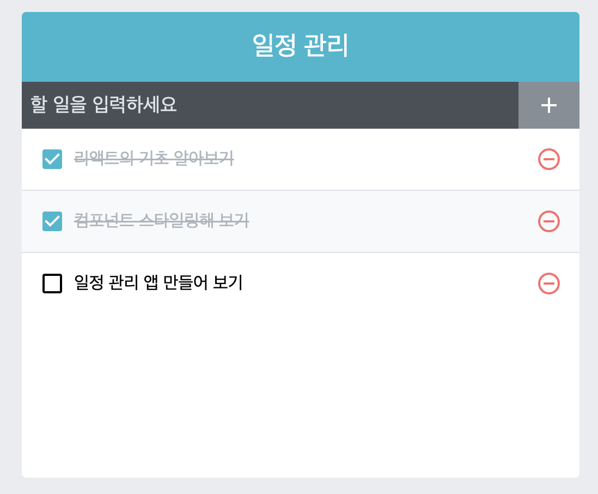

   <br>

## 기능 구현하기 - Typescript Version

* 해야 할 일정에 대한 항목, 그리고 추가 할 항목들은 `App.tsx`에서 관리합니다.

* `App.tsx`에서 `useState`를 사용하여 `todos`상태를 만들고,<br>
이를 `props`로 컴포넌트에 내려보낼 것 입니다.

`App.tsx`
```typescript
import React, {useState} from 'react';
import TodoTemplate from './TodoTemplate';
import TodoInsert from './TodoInsert';
import TodoList from './TodoList';

interface Todo{
    id : number;
    text : string;
    checked : boolean;
}

const App = () : JSX.Element => {
    const [todos, setTodos] = useState<Todos>([
        {
            id : 1, 
            text : '리액트의 기초 알아보기',
            checked : true,
        },
        {
            id : 2,
            text : '컴포넌트 스타일링해 보기',
            checked : true,
        },
        {
            id : 3,
            text : '일정 관리 앱 만들어 보기',
            checked : false,
        },
    ]);

    return (
        <TodoTemplate>
            <TodoInsert />
            <TodoList todos={todos} />
        </TodoTemplate>
    )
}
export default App;
```
* 바로 `<TodoList>` 항목에 에러가 날 텐데, `TodoList.tsx` 내부에<br>
`props` 설정을 해 주지 않아서 그렇습니다. 일단 의미를 짚겠습니다.

* 넘겨주게 될 `todos` 배열에 대해서 설명해 보도록 하겠습니다.<br>
`Todo` 형태의 객체를 배열로 가지고 있는 상태입니다.

    * `id` : 나중에 `TodoListItem`의 `key` 속성이 될 변수
    * `text` : 해야 할 일을 보여주는 `string`
    * `checked` : 완료 하였는지 알려주는 `boolean`

* 이 속성을 모아 `Todo` 인터페이스를 만듭니다.

* 커스텀 `state`는 `useState`에 따로 만든 인터페이스를 줘야 인식할 수 있습니다.<br>
따라서, `Todo[]` 인터페이스를 전달해 초기 값을 인식 할 수 있게 만듭니다.

   <br>

`TodoList.tsx`
```typescript
import React from 'react';
import TodoListItem from './TodoListItem';
import './TodoList.scss';

interface Todo{
    id : number;
    text : string;
    checked : boolean;
}

interface Todos{
    todos : Todo[];
}

const TodoList = ({todos} : Todos) => {
    return (
        {todos.map((todo) => (
            <TodoListItem todo={todo} key={todo.id} />
        ))}
    )
}
export default TodoList;
```
* 이 코드에서 `<TodoListItem>`속성의 `todo`에서 오류가 날 텐데<br>
이는 `TodoListItem.tsx`에서 `props`속성에서 `todo`를 설정 하지 않아 그렇습니다.

* 이것도 일단 의미를 짚고 넘어가겠습니다!

* `App.tsx`에서 `Todo`인터페이스를 가져와 쓸 수 있지만, 계속 작성 해 보시는게 <br>
공부에 도움이 되실 거라 생각해서 계속해서 작성하겠습니다.<br>
헷갈리지도 않으실 거예요!

* 이 코드에서 `props`로 `{todos}` 형태로 받는다고 되어 있습니다.

* 이를 위해서는 `todos`를 포함한 인터페이스를 만들어 줘야 합니다.

* 따라서, `Todos` 인터페이스를 만들고, 내부에 `Todo[]`를 선언해 줘야 합니다.

* 즉, 비구조화 추출 과정에 `Todos`라는 형태의 `props`에서 `todos`를 추출한다는<br>
뜻입니다.

* 이 컴포넌트에서는 `todo`객체를 다시 `TodoListItem`에 `props`로 내려보냅니다.

   <br>

`TodoListItem.tsx`
```typescript
import React from 'react';
import {
    MdCheckBoxOutlineBlank,
    MdCheckBox,
    MdRemoveCircleOutline,
} from 'react-icons/md';
import cn from 'classnames';
import './TodoListItem.scss';

interface Todo{
    todo : {
        id : number;
        text : string;
        checked : boolean;
    };
}

// 1. 에서 설명
const TodoListItem = ({todo} : Todo) => {

    // todo 속성에서 비구조화 할당으로 text, checked 추출
    const {text, checked} = todo;

    // cn으로 인한 컴포넌트 변화는 2. 에서 설명
    return(
        <div className="TodoListItem">
            <div className={cn('checkbox', {checked})}>
                {checked ? <MdCheckBox/> : <MdCheckBoxOutlineBlank/>}
                <div className="text">{text}</div>
            </div>
            <div className="remove">
                <MdRemoveCircleOutline/>
            </div>
        </div>
    )
}
export default TodoListItem;
```

1. * 이번엔 `TodoListItem`에서 `props`를 `{todo}`형태로 <br>
받는다고 선언 되어 있습니다.

    * 따라서, 이번엔 `Todo`인터페이스에 `todo`속성을 넣어 조건을 만족시켜야 합니다.

    * `Todo`인터페이스에 `id`, `text`, `checked` 속성을 넣어주면 됩니다.

    * 이후,  `{todo} : Todo`를 통해, `props`도 비구조화 할당으로 <br>
    `Todo`에서 추출한다고 선언 한 것과 같은 의미입니다.

   <br>

2. * `cn`은 `classnames`모듈로, 컴포넌트의 `className`속성에 동적으로<br>
관여하는 프로그램입니다.

    * `className={cn('checkbox', { checked })}`

    * `checkbox`속성은 기본으로 가지고, `checked`속성이 `true`인지, <br> `false`인지 에 따라 `checked`에 들어갈지가 결정됩니다.

   <br>

* 컴포넌트 내부의 삼항 연산자는 일정이 완료되었는지 아닌지에 따라, <br>
들어가게 되는 `react-icon`이 달라집니다.

    * `checked : true` : `<MdCheckBox />`
    * `checked : false` : `<MdCheckBoxOutlineBlank />`

<hr>

## 결과물



* `checked` 값에 따라 체크 혹은 미체크가 되며, 일반 글씨 혹은 그어진 글씨가 됩니다.

<hr>

