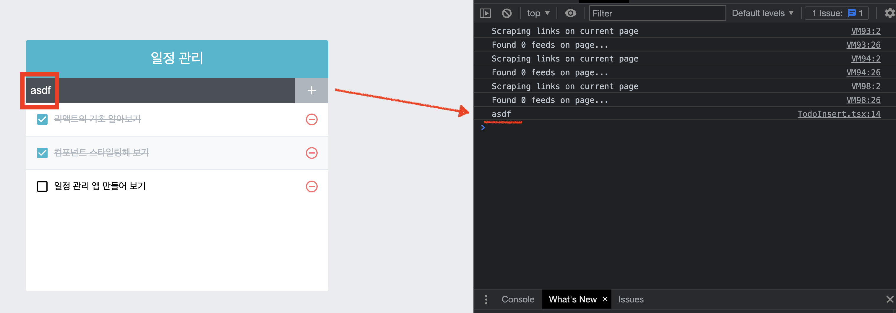
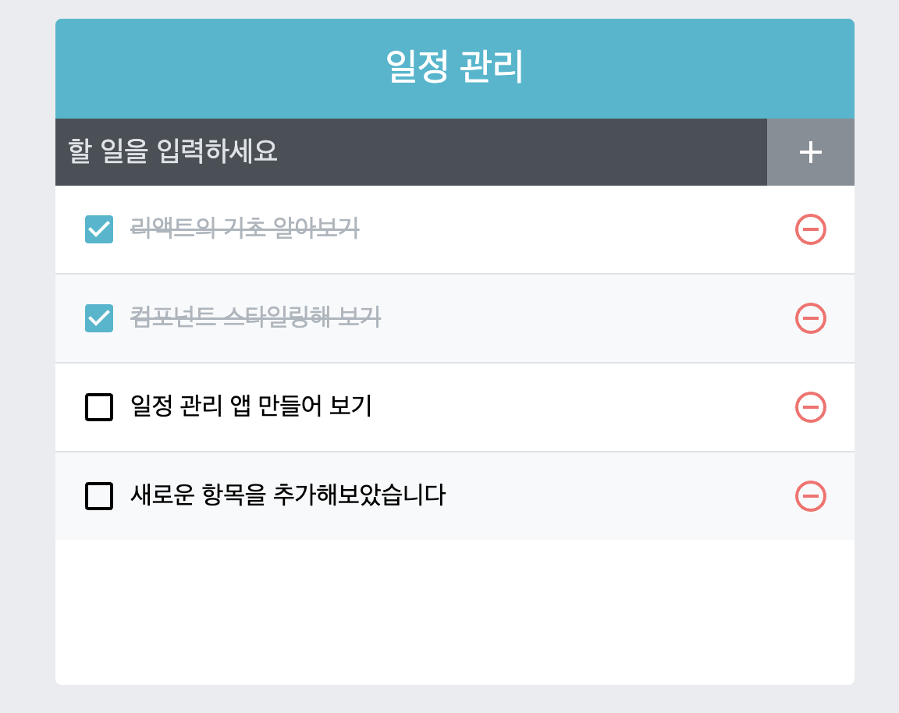

   <br>

## 항목 추가 기능 구현하기 - Typescript Version

* `TodoInsert.tsx`의 `<input>`에 입력되는 글자를 상태관리로 인식될 수 있게 만듭니다.

* `<button>` 클릭 시, `<input>`글자를 바탕으로 `todos`객체에 변화를 주게 됩니다.

   <br>

`TodoInsert.tsx`
```typescript
import React, {useState, useCallback} from "react";
import {MdAdd} from 'react-icons/md';
import './TodoInsert.scss';

const TodoInsert = () : JSX.Element => {
    const [value, setValue] = useState('');

    const onChange = useCallback((e : React.ChangeEvent<HTMLInputElement>) => {
        setValue(e.target.value);
    }, []);

    // 책에 없는 내용으로 이는 개발자 콘솔에서 이벤트 결과를 보기 위해서
    // 넣은 onClick함수입니다.
    // state 관련 변수는 전부 배열 안에 넣어주는 것이 좋습니다.
    const onClick = useCallback((e : React.MouseEvent<HTMLButtonElement>) => {
        e.preventDefault();
        console.log(value);
    }, [value])

    return (
        <form className="TodoInsert">
            <input 
                placeholder="할 일을 입력하세요"
                value={value}
                onChange={onChange}
            />
            <button type="submit" onClick={onClick}>
                <MdAdd/>
            </button>
        </form>
    )
}
export default TodoInsert;
```

* 지금까지 직접 코드를 치고 있었는데, 혹시 모를 체킹을 위해서 지금부터 <br>
에디터에서 코드를 치고, 복사 후 보여줄 것입니다.

* `<input>` 내부의 글자를 인식하기 위해 `useState`를 사용하여 상태를 만듭니다.

* `const onChange` 함수는 `<input>`에서 일어나는 이벤트를 중점으로 직접 `value` 상태를 관리하기 위해 만들어진 함수입니다.

* `useCallback`을 이용하여 최적화 관리를 해줍니다.

    * 두 번째 인자인 배열에 아무것도 없습니다.
    * 이는 내부에 `state`관련 변수가 없으므로, 처음 렌더링 시에만 생성해도 상관없습니다.

<hr>

## 결과물



<hr>

   <br>

## todos 배열에 새 객체 추가하기

* 지금은 `TodoInsert.tsx`에서 `value` 상태가 변해도 `todos`배열에 <br>
추가할 수 없습니다.

* 따라서, `App.tsx`에서 `callback` 함수를 직접 만들어서 하위 컴포넌트에<br>
직접 내려보내게 됩니다.

    * `App.tsx`의 `todos` 상태에 접근하기 위해서는 `callback` 함수에서<br>
    `todos`를 접근 할 수 있게 상태를 직접 넣어주면 됩니다.

* `App.tsx`에 콜백 함수를 만들어 예시를 보이겠습니다.

`App.tsx`
```typescript
import React , {useCallback, useRef, useState} from 'react';
import TodoInsert from './components/TodoInsert';
import TodoTemplate from './components/TodoTemplate';
import TodoList from './components/TodoList';

interface Todo{
    id : number;
    text : string;
    checked : boolean;
}

const App = () : JSX.Element => {
const [todos, setTodos] = useState<Todo[]>([
    {
        id : 1,
        text : '리액트의 기초 알아보기',
        checked : true,
    },
    {
        id : 2,
        text : '컴포넌트 스타일링해 보기',
        checked : true,
    },
    {
        id : 3,
        text : '일정 관리 앱 만들어 보기',
        checked : false,
    },
    ]);

    // todo 추가 시, 다음 key로 사용될 변수입니다.
    const nextId = useRef(4);

    // 1. 에서 설명합니다.
    const onInsert = useCallback((text : string) => {
        const todo : Todo = {
            id : nextId.current,
            text,
            checked : false,
        };
        setTodos(todos.concat(todo));
        nextId.current += 1;
    }, [todos])

    // 2. 에서 설명합니다.
    return (
        <TodoTemplate>
            <TodoInsert onInsert={onInsert}/>
            <TodoList todos={todos}/>
        </TodoTemplate>
    )
}
export default App;
```

## 1. 

* `App.tsx`의 하위 컴포넌트에서 `App`컴포넌트의 `todos`객체에 접근할 수 있게<br>
만들어 진 함수입니다.

* 즉, `todos` 접근 권한을 하위 컴포넌트에 부여하는 함수라고 인식하면 편합니다.<br>
아주 정확한 의미는 아닙니다...!

* `TodoInsert.tsx`의 `<insert>`에 입력된 `string`을 바탕으로 실행됩니다.

* 따라서 입력 값은 `text : string`이 됩니다.

* `setTodos`실행시 내부엔 `.push`가 아닌 `.concat`으로 해야합니다.
    
    * 새로운 배열을 생성하여 반환하기 때문입니다. - 깊은 복사

* 2 번째 인자인 배열에는 `todos`를 넣어 `todos`가 변할 때 마다 새로 <br>
생성하게 합니다.

## 2.

* `<TodoInsert>`에 새로운 `props`속성인 `onInsert` 속성을 넣습니다.

* 물론 지금은 오류가 나지만, 곧 `props` 설정을 하므로 괜찮습니다.

* 콜백 함수로 전달되는 이 함수의 타입은

    * `onInsert : (text : string) => void` 가 됩니다.

* 인터페이스에서 설정해야 되서 인식하시면 됩니다!

<hr>

## TodoInsert에서 onSubmit 이벤트 설정하기

`TodoInsert.tsx`
```typescript
import React, {useState, useCallback} from "react";
import {MdAdd} from 'react-icons/md';
import './TodoInsert.scss';

interface PropsIFace{
    onInsert : (text : string) => void;
}

const TodoInsert = ({onInsert} : PropsIFace) : JSX.Element => {
    const [value, setValue] = useState('');

    const onChange = useCallback((e : React.ChangeEvent<HTMLInputElement>) => {
        setValue(e.target.value);
    }, []);

    const onSubmit = useCallback((e : React.FormEvent<HTMLFormElement>) => {
        // callback 함수를 이용하여 "todos" 객체에 변화를 일으킵니다.
        onInsert(value);

        //input의 글자를 입력 완료했으므로, 초기화시킵니다.
        setValue('');

        // submit 이벤트는 브라우저 새로고침을 일으킵니다. 이를 방지하기 위해 선언하는 함수입니다.
        e.preventDefault();
    }, [value])

    return (
        <form className="TodoInsert">
            <input 
                placeholder="할 일을 입력하세요"
                value={value}
                onChange={onChange}
            />
            <button type="submit" onClick={onSubmit}>
                <MdAdd/>
            </button>
        </form>
    )
}
export default TodoInsert;
```

* 따로 인터페이스를 생성하여 콜백 함수를 `props`로 받을 수 있게 만듭니다

    * `onInsert : (text : string) => void`
    * `onInsert`함수가 `string`을 변수로 받고 `todos`를 변경하지만,<br>
    따로 어떠한 값을 반환하지는 않으므로, `void`로 선언합니다.

* `<form>`에서 엔터 클릭 시, <br> 
`React.FormEvent<HTMLFormElement>` 이벤트를 일으킵니다.

    * 이 이벤트는 새로고침을 발생시키므로,
    * `e.preventDefault()`를 선언하여 새로고침을 방지합니다

<hr>

## 결과물



<hr>

* 다음 편에서, 지우기 기능도 만들 예정입니다.