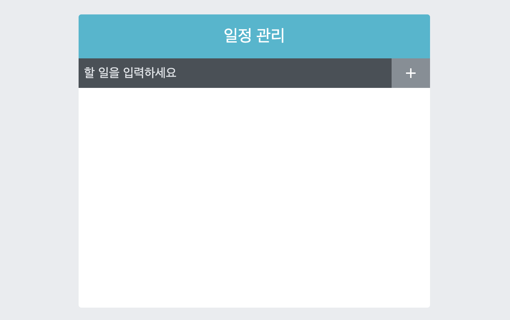

   <br>

## 지우기 기능 구현하기 - Typescript Version

* 배열 내장 함수 `filter`를 사용하여 지우기 기능을 구현합니다

    * `array.filter(number => number > 5)`
    * `array`배열 중에서 5 보다 큰 숫자만 배열로 반환합니다.

* 이를 바탕으로, 지우기 기능을 구현 해 보겠습니다.

   <br>

`App.tsx`
```typescript
import React , {useCallback, useRef, useState} from 'react';
import TodoInsert from './components/TodoInsert';
import TodoTemplate from './components/TodoTemplate';
import TodoList from './components/TodoList';

interface Todo{
  id : number;
  text : string;
  checked : boolean;
}

const App = () : JSX.Element => {

  (...)
  // 밑에서 설명
  const onRemove = useCallback((id : number) => {
    setTodos(todos.filter(todo => todo.id !== id));
  }, [todos])

  return (
    <TodoTemplate>
      <TodoInsert onInsert={onInsert}/>
      <TodoList todos={todos} onRemove={onRemove} />
    </TodoTemplate>
  )
}
export default App;
```

* `filter` 함수를 이용하여 새로운 `todos`배열을 반환하여 `setTodos`<br>
를 실행합니다.

    * 변수로 들어온 `id`를 가진 `Todo`객체 하나를 제외하고 반환한다.
    * 이는 제거한다는 의미와 동일하다.

* 새로이 전달할 콜백 함수를 `TodoList` 컴포넌트에 전달한다.

그리고 새롭게 `TodoList.tsx`를 수정합니다.

`TodoList.tsx`
```typescript
import React from "react";
import TodoListItem from "./TodoListItem";
import './TodoList.scss';

interface Todo{
    id : number;
    text : string;
    checked : boolean;
}

interface Todos{
    todos : Todo[];
    onRemove : (id : number) => void;
}

const TodoList = ({todos, onRemove} : Todos) : JSX.Element => {
    return (
        <div className="TodoList">
            {todos.map((todo) => (
                <TodoListItem todo={todo} key={todo.id} onRemove={onRemove}/>
            ))}
        </div>
    )
}
export default TodoList;
```

* `props`로 `todos` 그리고 `onRemove`라는 함수를 받습니다.

* 따라서, `Todos` 인터페이스에 `onRemove`를 추가하여 <br>
`props`를 받는 과정에서 비구조화 추출이 가능하게 만듭니다.

* 그리고 `props`로 받아온 `onRemove` 함수를 다시<br>
`TodoListItem`으로 전달하기 위해 컴포넌트에 넣습니다.

   <br>

`TodoListItem.tsx`
```typescript
import React from "react";
import {
    MdCheckBoxOutlineBlank,
    MdCheckBox,
    MdRemoveCircleOutline,
} from 'react-icons/md'
import cn from 'classnames';
import './TodoListItem.scss';

interface Todo{
    todo : {
        id : number;
        text : string;
        checked : boolean;
    };
    onRemove : (id : number) => void;
}

const TodoListItem = ({todo, onRemove} : Todo) : JSX.Element => {
    const {id, text, checked} = todo;

    return (
        <div className="TodoListItem">
            <div className={cn('checkbox', {checked})}>
                {checked ? <MdCheckBox/> : <MdCheckBoxOutlineBlank/>}
                <div className="text">{text}</div>
            </div>
            <div className="remove" onClick={() => onRemove(id)}>
                <MdRemoveCircleOutline/>
            </div>
        </div>
    )
}
export default TodoListItem;
```

* 결국, `App.tsx`에서 만들어진 `onRemove` 함수가 `TodoListItem`으로 내려왔습니다.

* `onRemove`의 타입을 인터페이스에 선언해 `props`로 받을 수 있게 만듭니다.

    * `onRemove : (id : number) => void`
    * 삭제 할 `todo`의 `id`를 변수로 받고, 이 `id`를 가진 `todo` 객체를 삭제합니다.

* 빨간색으로 되어 있는 `<MdRemoveCircleOutline/>`를 클릭하면<br>
리스트에서 삭제되게 됩니다

<hr>

## 결과물



* 삭제를 전부 클릭하여 리스트를 없애 본 모습입니다!

<hr>

