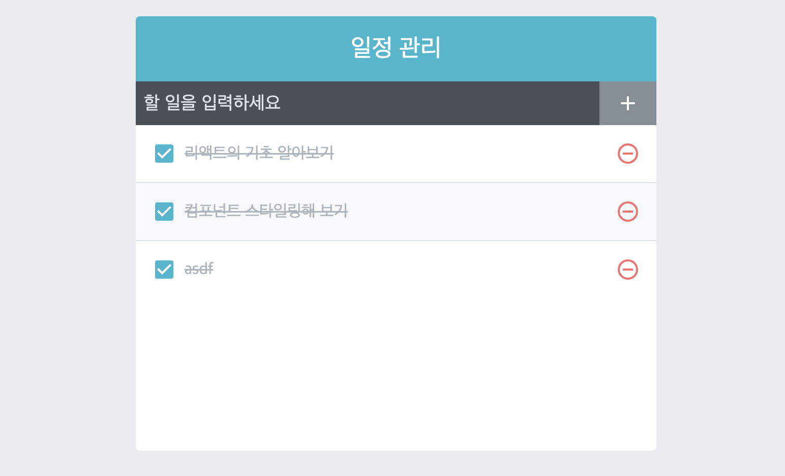

   <br>

## 수정 기능 추가하기 `onToggle` - Typescript

* 이번엔 `<TodoListItem>`의 체크박스를 클릭하여 토글하는 기능을<br>
추가 해볼 겁니다!

* 이번에도 `App.tsx`에서 `onToggle` 함수를 만들고, `TodoListItem.tsx`<br>
까지 `props`로 내려보냅니다.

* `onToggle` 함수는 `id`를 받아 그 `todo`에 해당하는 객체의 <br>
`checked` 항목을 반대로 변경합니다(boolean)

`App.tsx`
```typescript
import React , {useCallback, useRef, useState} from 'react';
import TodoInsert from './components/TodoInsert';
import TodoTemplate from './components/TodoTemplate';
import TodoList from './components/TodoList';

interface Todo{
  id : number;
  text : string;
  checked : boolean;
}

const App = () : JSX.Element => {

  (...)

  const onToggle = useCallback((id : number) => {
    setTodos(
        todos.map((todo : Todo) => 
            todo.id === id ? {...todo, checked : !todo.checked } : todo
        )
    )
  }, [todos])

  return (
    <TodoTemplate>
      <TodoInsert onInsert={onInsert}/>
      <TodoList todos={todos} onRemove={onRemove} onToggle={onToggle} />
    </TodoTemplate>
  )
}
export default App;
```

* 이번엔 `filter` 가 아닌 `map`이 사용되었습니다.

* 이 함수의 의미에 대해 깊게 짚어보고 넘어가겠습니다

    * `todos.map()` : `todos`의 `Todo`형태의 객체들에 함수를 적용하여 다시 배열로 반환합니다.

    * `(todo : Todo) =>` : `todos`의 원소는 `Todo` 타입을 가진다고 명시했습니다.<br>
    좀 더 편한 코딩을 위해 넣어두었습니다.

    * `todo.id === id ?` : 삼항 연산자의 초기 조건입니다.<br>
    현재 함수 적용중인 `todo`의 `id`와, 입력된 `id`가 일치한다면 `true`<br>
    일치하지 않는다면 `false`를 반환합니다.

    * `false`라면, 변경되지 않은 그대로의 원소를 반환합니다.

    * `true`라면, `{...todo}`하여 `todo`안에 존재하던 속성을 전개 연산자`...`로 복사합니다.<br>
    그 후, `todo` 내부의 `checked` 속성을 `!` 하여 반전시킵니다.

* 이 과정을 거치면서 토글을 하게 됩니다.

이 함수를 사용하기 위해 `TodoList.tsx`, `TodoListItem.tsx`를 변경해야 합니다.

`TodoList.tsx`
```typescript
import React from "react";
import TodoListItem from "./TodoListItem";
import './TodoList.scss';

interface Todo{
    id : number;
    text : string;
    checked : boolean;
}

interface Todos{
    todos : Todo[];
    onRemove : (id : number) => void;
    onToggle : (id : number) => void
}

const TodoList = ({todos, onRemove, onToggle} : Todos) : JSX.Element => {
    return (
        <div className="TodoList">
            {todos.map((todo) => (
                <TodoListItem todo={todo} key={todo.id} onRemove={onRemove} onToggle={onToggle}/>
            ))}
        </div>
    )
}
export default TodoList;
```

* `props` 속성을 만족하기 위해 `onToggle`을 인터페이스로 넣게 됩니다!

`TodoListItem.tsx`
```typescript
import React from "react";
import {
    MdCheckBoxOutlineBlank,
    MdCheckBox,
    MdRemoveCircleOutline,
} from 'react-icons/md'
import cn from 'classnames';
import './TodoListItem.scss';

interface Todo{
    todo : {
        id : number;
        text : string;
        checked : boolean;
    };
    onRemove : (id : number) => void;
    onToggle : (id : number) => void;
}

const TodoListItem = ({todo, onRemove, onToggle} : Todo) : JSX.Element => {
    const {id, text, checked} = todo;

    return (
        <div className="TodoListItem">
            <div className={cn('checkbox', {checked})} onClick={() => onToggle(id)}>
                {checked ? <MdCheckBox/> : <MdCheckBoxOutlineBlank/>}
                <div className="text">{text}</div>
            </div>
            <div className="remove" onClick={() => onRemove(id)}>
                <MdRemoveCircleOutline/>
            </div>
        </div>
    )
}
export default TodoListItem;
```
* 리스트를 구성하는 컴포넌트인 `TodoListItem`에까지 `onToggle`이 도착하여<br>
체크박스 부분의 `<div>`에 `onClick`에 적용하여 완료합니다.

<hr>

## 결과물



<hr>

# 정리

* 전에 작성했었던 컴포넌트들과 다르게, <br> 
여러 개의 컴포넌트를 묶어 복잡한 컴포넌트를 작성해 보았습니다.

   <br>

`App.tsx` => `TodoInsert.tsx`

* `onInsert` 함수 전달

* `TodoInsert`의 `<input>`내부의 문자열로 `todo` 추가

   <br>

`App.tsx` => `TodoList.tsx` => `TodoListItem.tsx`

* `todos`, `onRemove`, `onToggle` 전달

* `TodoList`에서 `todos.map`으로 여러개의 `TodoListItem`생성

* `TodoListItem`에서 `onRemove`, `onToggle` 실행
